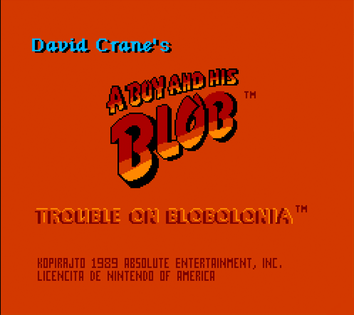
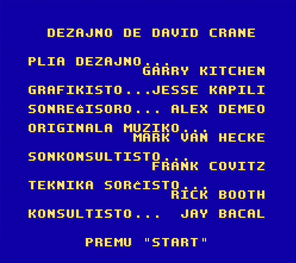
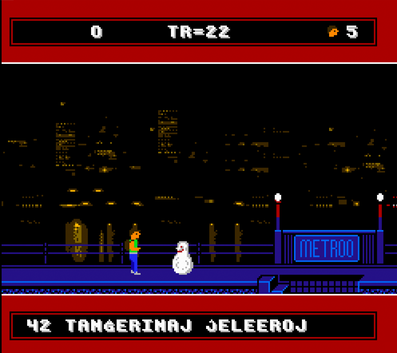
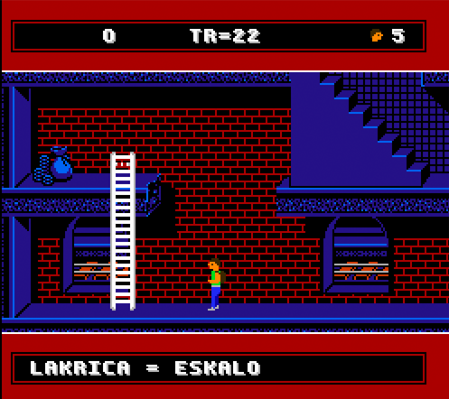

# A Boy and His Blob

This project is a fan translation of
[A Boy and His Blob](https://en.wikipedia.org/wiki/A_Boy_and_His_Blob:_Trouble_on_Blobolonia),
a video game for the Nintendo Entertainment System, to Esperanto. All
copyrights to the original game belong to Nintendo and Absolute Entertainment
and no infringement is intended.

## Requirements
You *must* own a physical copy of the Boy and His Blob cartridge. Downloading
the ROM of any game which you do not own is piracy.

  * A Boy and His Blob - CRC32 `20A9E4A2`

## Development

The following software is used for development:

  * your prefered hex editor
  * [FCEUX](https://fceux.com/web/home.html) - debugger
  * [YY-Chr](https://www.romhacking.net/utilities/958) - graphic editor

Most of the above utilities run on Windows while the build script `build.sh`
scripts the final patching and invokes unix/Linux utilities. You can either use
[Cygwin](http://cygwin.com) to run the build script on Windows or
[Wine](https://winehq.org) to run the utilities on non-Windows platforms.

Special thanks also to **sewave** for his
[Spanish translation](https://github.com/sewave/translations/tree/master/nes/boyandhisblobatroubleonblobolonianes).

## Completed

The following tasks are (more or less) complete.

  * Modify font files for esperanto letters
  * Translate and replace in-game text (bean selection)
  * Translate game credits
  * Update background tiles (signs)

## To Do  

The following tasks are still outstanding (in approximate order of importance).
**Contributors are welcome!**

  * Shop text
  * Translate winning end text
  * Build/patching documentation

## Screenshots

Here are some pretty screenshots:

