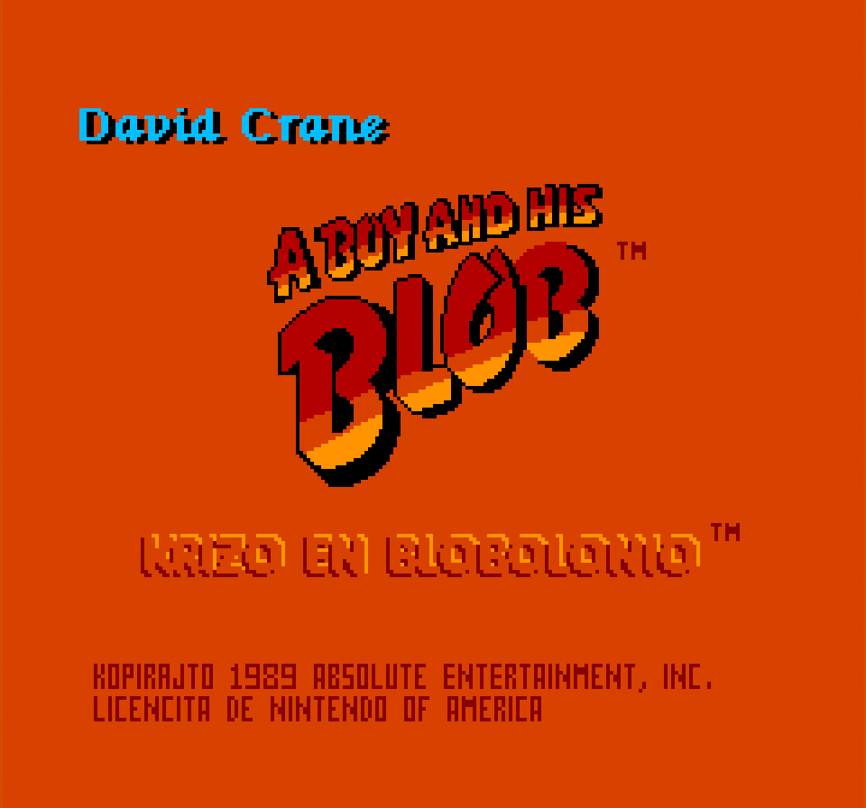
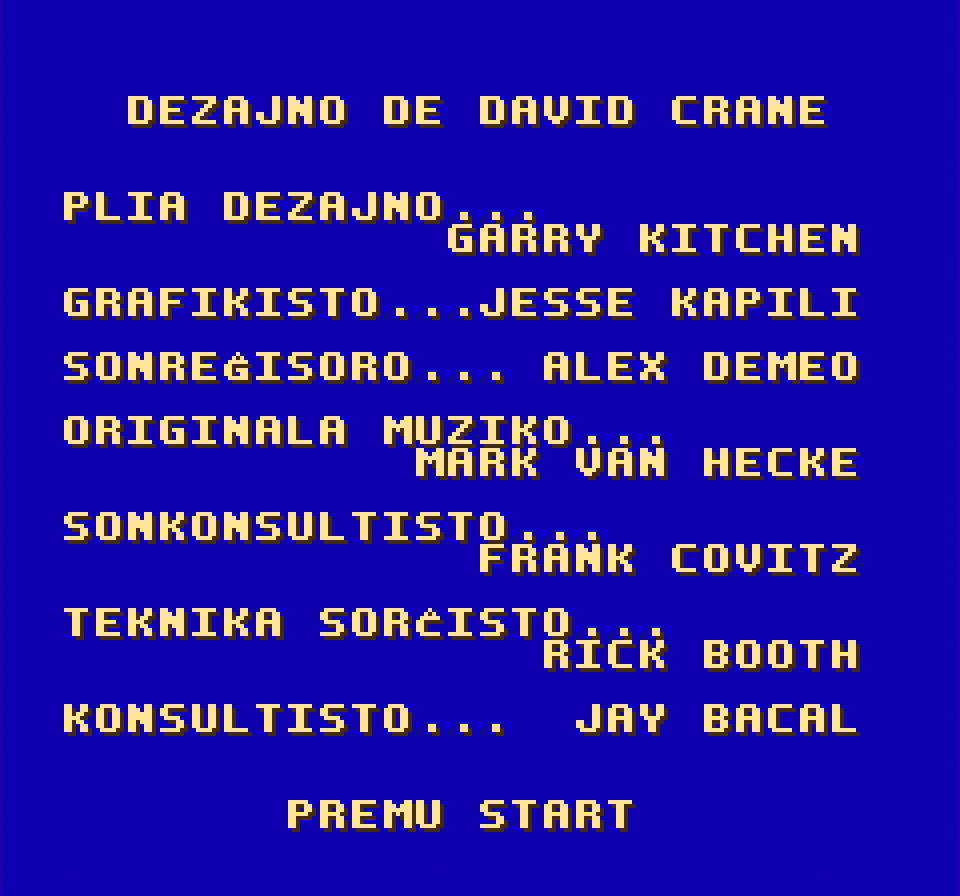
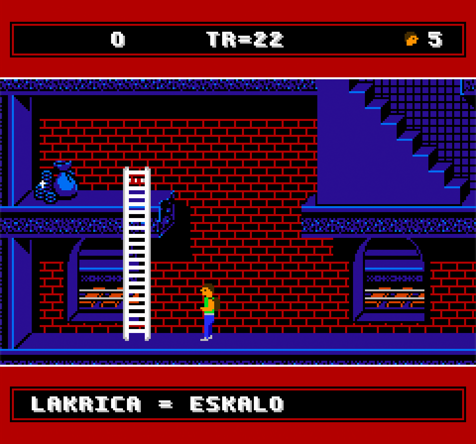
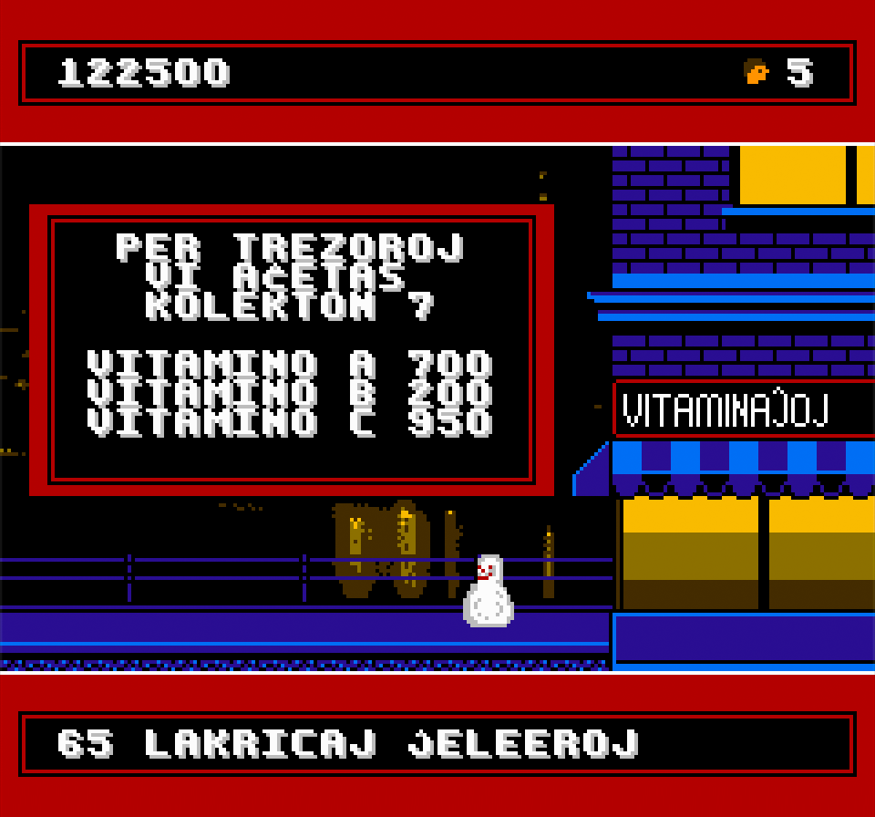
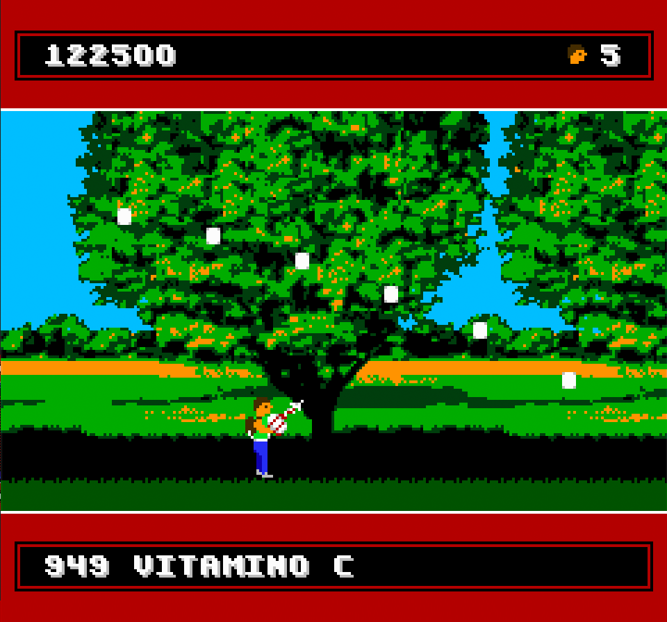

# A Boy and His Blob: Trouble in Blobolonia

This project is a fan translation of
[A Boy and His Blob: Trouble in Blobolonia](https://en.wikipedia.org/wiki/A_Boy_and_His_Blob:_Trouble_on_Blobolonia),
a video game for the Nintendo Entertainment System, to Esperanto. All
copyrights to the original game belong to Nintendo and Absolute Entertainment.

You *must* own a physical copy of the Boy and His Blob cartridge. Downloading
the ROM of any game which you do not own is piracy.

  * A Boy and His Blob - CRC32 `20A9E4A2`

## Screenshots

Here are some pretty screenshots:

